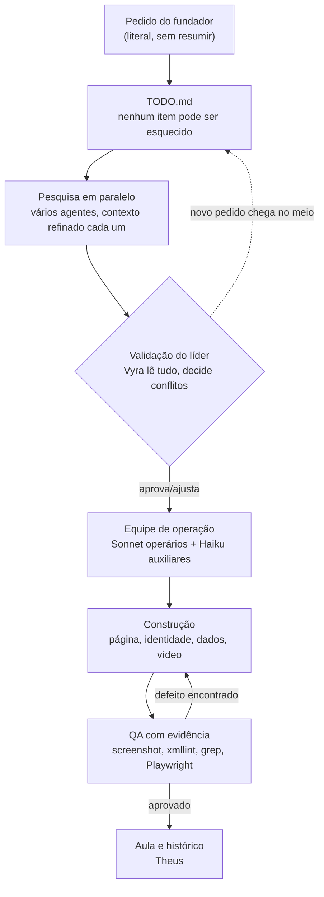

> **Nota de origem (19/09/2026).** Esta aula foi escrita pelo Theus na sessão de 13/09/2026, numa pasta anterior do REINO (a da landing page, pesquisa, GraphRAG e estúdio de vídeo). Ela foi trazida para cá como material de estudo e como fonte do método que este projeto segue.
> Os caminhos citados (`01-contexto/`, `02-identidade-visual/`, `04-nomenclatura/`, `05-reino-site/`, `07-estudio-video/`, `08-graphrag/`, `09-instalador/`, `06-aulas/_fontes/`...) **não existem nesta pasta** — só `CLAUDE.md`, `.claude/` e `00-comando/` têm equivalente aqui. O hook desta pasta foi reescrito em Python (sem `jq`); o texto do Módulo 1 mostra a versão original em bash.

# A aula completa — tudo o que aconteceu na construção do REINO

> Público: alunos do fundador que vão abrir esta pasta para aprender a conduzir um projeto real com Claude Code e uma equipe de agentes.
> Cada módulo responde: **objetivo**, **explicação**, **exemplo real** (com caminho clicável), **exercício prático** e **checklist**.
> Fonte de tudo o que está aqui: `06-aulas/_fontes/LINHA-DO-TEMPO-DA-CONVERSA.md`, `00-comando/logs/` e os documentos gerados pelos agentes, todos linkados ao longo do texto. Nada aqui é inventado — o que não está registrado nos logs aparece como "não registrado".

---

## Módulo 0 — O projeto e o método, em uma página

### Objetivo
Entender, antes de qualquer detalhe técnico, **o que é o Reino** e **como esta pasta foi construída** — para que o resto da aula faça sentido.

### Explicação

O **Reino** é um clube nacional de empresários com sete níveis, três que se compram (Visconde, Conde, Marquês) e quatro que se conquistam por rede e território (Duque, Príncipe, Rei, Imperador), inspirado em Êxodo 18:21-25 — os chefes de mil, de cem, de cinquenta e de dez que Jetro recomendou a Moisés. A sigla do mapa mental original é **R.E.I.N.O.**: Relacionamento, Empresários, Influência, Network, Oportunidades.

Mas esta aula não é sobre o Reino como produto — é sobre **como uma pasta vazia com um `CLAUDE.md` em branco, um HTML e um PDF de mapa mental** se tornou, numa única sessão de trabalho no dia 13/09/2026, uma pasta inteira: pesquisa licenciada, identidade visual corrigida, uma página pronta, um estudo de governança de 7.000 anos, um GraphRAG caseiro, um estúdio de vídeo, e esta própria aula.

O método que a liderança (Vyra, Opus 5) seguiu, do primeiro pedido do fundador até aqui, tem uma forma repetível:



Note a seta pontilhada: **o fundador fez pedidos novos no meio do trabalho** (o estudo do Higgsfield na seção 4 da linha do tempo, o GraphRAG na seção 6, o pedido final de conclusão na seção 9). O método aguentou isso porque o `TODO.md` cresce por seções (A, B, C... K) em vez de ser uma lista fixa — cada pedido novo ganha sua própria seção, sem perder o que já estava em andamento.

### Exemplo real
- O pedido inteiro do fundador, sem cortes: `06-aulas/_fontes/LINHA-DO-TEMPO-DA-CONVERSA.md`, seção 1.
- O `TODO.md` com as 11 seções (A a K): `00-comando/TODO.md`.
- O log geral, uma linha por tarefa, na ordem em que aconteceu: `00-comando/logs/LOG.md`.

### Exercício prático
Abra `00-comando/TODO.md` e conte quantos itens têm `[x]` (concluído) contra quantos ainda têm `[ ]`. Depois abra `00-comando/logs/LOG.md` e ache a linha que corresponde ao item mais recente ainda não marcado. O que está faltando, e por quê (dica: releia o Módulo 9 e o final do Módulo 10)?

### Checklist do módulo
- [ ] Você sabe explicar o Reino em uma frase, sem abrir nenhum outro arquivo.
- [ ] Você sabe apontar, no diagrama, onde a liderança decide algo (não é a mesma caixa onde ela pesquisa).
- [ ] Você encontrou pelo menos um pedido novo do fundador que entrou no meio do trabalho, na linha do tempo.

---

## Módulo 1 — Claude Code por dentro

### Objetivo
Entender onde o Claude Code procura instrução (`CLAUDE.md`), como automatizar comportamento (hooks), como montar uma equipe (agentes) e como dar habilidades específicas a cada um (skills) — com o código real deste projeto, linha a linha.

### Explicação

#### 1.1 `CLAUDE.md`: a memória do projeto
O `CLAUDE.md` na raiz (113 linhas) é lido automaticamente no início de toda sessão e de todo subagente. Ele guarda regras que **valem para todo mundo**: o que é o Reino, a paleta de cores, a tipografia, o mapa da pasta. A fonte oficial confirmada pelo agente Ferreiro (`01-contexto/01-claude-code/GUIA-CLAUDE-CODE.md` §1) diz que arquivos de memória **se somam** (política gerenciada → usuário → projeto → local) e que o ideal é menos de 200 linhas — acima disso, a aderência cai.

O próprio `CLAUDE.md` do Reino usa um truque didático: um comentário HTML marca o bloco que deve ser reinjetado como resumo:

```html
<!-- REGRAS-ESSENCIAIS:INICIO -->
## Regras essenciais (valem para a Vyra e para todo subagente)
1. Projeto: REINO...
...
<!-- REGRAS-ESSENCIAIS:FIM -->
```

#### 1.2 O hook, linha a linha

O pedido do fundador foi: um hook que reinjeta o `CLAUDE.md` "a cada ação do agente". Veja o script completo, `.claude/hooks/injetar-contexto.sh`:

```bash
#!/usr/bin/env bash
set -euo pipefail

MODO="${1:-completo}"
RAIZ="${CLAUDE_PROJECT_DIR:-$(cd "$(dirname "$0")/../.." && pwd)}"
ARQUIVO="$RAIZ/CLAUDE.md"

ENTRADA="$(cat || true)"
EVENTO="$(printf '%s' "$ENTRADA" | jq -r '.hook_event_name // "UserPromptSubmit"' 2>/dev/null || echo UserPromptSubmit)"

[ -f "$ARQUIVO" ] || exit 0

if [ "$MODO" = "resumo" ]; then
  TEXTO="$(awk '/<!-- REGRAS-ESSENCIAIS:INICIO -->/{f=1;next}/<!-- REGRAS-ESSENCIAIS:FIM -->/{f=0}f' "$ARQUIVO")"
  TEXTO="Contexto do projeto REINO (resumo do CLAUDE.md):
$TEXTO"
else
  TEXTO="Contexto do projeto REINO (CLAUDE.md integral):
$(cat "$ARQUIVO")"
fi

LOGDIR="$RAIZ/00-comando/logs"
[ -d "$LOGDIR" ] && printf '%s\t%s\t%s\n' "$(date '+%Y-%m-%d %H:%M:%S')" "$EVENTO" "$MODO" >> "$LOGDIR/hook-ingestao.tsv"

jq -n --arg ev "$EVENTO" --arg ctx "$TEXTO" \
  '{hookSpecificOutput: {hookEventName: $ev, additionalContext: $ctx}}'
```

Explicando cada trecho:
1. `set -euo pipefail` — o script para no primeiro erro, sem seguir com dados incompletos.
2. `MODO="${1:-completo}"` — recebe `completo` ou `resumo` como argumento, definido em `settings.json` (abaixo).
3. `RAIZ=...` — usa a variável `CLAUDE_PROJECT_DIR` que o próprio Claude Code exporta; se não existir (ex.: rodando o script à mão), calcula a raiz a partir da posição do próprio arquivo.
4. `ENTRADA="$(cat || true)"` — o Claude Code manda um JSON pelo **stdin** com dados do evento; o script lê tudo.
5. `EVENTO=...` — usa `jq` para extrair o campo `hook_event_name` desse JSON; sem `jq` ou sem o campo, assume `UserPromptSubmit`.
6. O `if`/`else`: no modo `resumo`, usa `awk` para cortar **só** o texto entre as duas marcas HTML — evita mandar o arquivo inteiro a cada ferramenta. No modo `completo`, manda o arquivo inteiro.
7. O bloco de log: registra data, evento e modo em `00-comando/logs/hook-ingestao.tsv`, um TSV simples, só se a pasta de logs existir. Esse é o arquivo que permite contar, hoje, **745 execuções do hook** (Módulo 9 e `HISTORICO-DETALHADO.md` trazem a contagem completa por evento).
8. O `jq -n` final monta a saída no formato exato que o Claude Code espera de um hook: `{hookSpecificOutput: {hookEventName, additionalContext}}`.

E a configuração em `.claude/settings.json`:

```json
{
  "hooks": {
    "SessionStart":     [{ "matcher": "startup|resume|clear|compact", "hooks": [{ "type": "command", "command": "\"$CLAUDE_PROJECT_DIR\"/.claude/hooks/injetar-contexto.sh completo" }] }],
    "UserPromptSubmit": [{ "hooks": [{ "type": "command", "command": "\"$CLAUDE_PROJECT_DIR\"/.claude/hooks/injetar-contexto.sh resumo" }] }],
    "SubagentStart":    [{ "hooks": [{ "type": "command", "command": "\"$CLAUDE_PROJECT_DIR\"/.claude/hooks/injetar-contexto.sh completo" }] }],
    "PreToolUse":       [{ "matcher": "*", "hooks": [{ "type": "command", "command": "\"$CLAUDE_PROJECT_DIR\"/.claude/hooks/injetar-contexto.sh resumo" }] }]
  }
}
```

#### Por que **integral** em `SessionStart`/`SubagentStart` e **resumo** em `PreToolUse`

A regra tem uma lógica de custo × cobertura, documentada pelo agente Ferreiro em `01-contexto/01-claude-code/GUIA-CLAUDE-CODE.md` §3.4:

1. A sessão principal já carrega o `CLAUDE.md` nativamente no início, e de novo depois de `/compact` — mas `SessionStart` com o matcher `startup|resume|clear|compact` garante que isso aconteça mesmo se algo no ambiente falhar, e cobre explicitamente o momento pós-compactação.
2. Um subagente comum já carrega toda a hierarquia de `CLAUDE.md` sozinho — **exceto** os agentes embutidos `Explore` e `Plan`, que pulam essa memória. `SubagentStart` sem `matcher` cobre esses casos também, por isso manda o arquivo **completo**.
3. `UserPromptSubmit` e `PreToolUse` já têm o `CLAUDE.md` completo no contexto (pelos dois pontos acima) — reinjetar tudo de novo a cada prompt ou a cada ferramenta **duplicaria** o conteúdo sem necessidade. Por isso mandam só o **resumo**.

**A conta em tokens** (medida pelo Ferreiro no próprio hook, 13:41): a saída completa tem 6.795 caracteres (~1.900–2.300 tokens estimados); o resumo tem 1.357 caracteres (~400–450 tokens). Numa sessão hipotética de 20 prompts e 150 chamadas de ferramenta, a configuração atual do projeto (completo em `UserPromptSubmit` + resumo em cada `PreToolUse`) gastaria cerca de **106 mil tokens** extras só de reinjeção; a recomendação do próprio guia (resumo curto em `UserPromptSubmit` e em `PostToolBatch` em vez de a cada ferramenta) cairia para cerca de **15 mil tokens**. Vale ler essa conta completa antes de copiar este hook para outro projeto sem ajuste.

A execução real: **722 vezes em `PreToolUse`**, **11 em `UserPromptSubmit`**, **8 em `SubagentStart`**, **4 em `SessionStart`** — total de 745 linhas em `00-comando/logs/hook-ingestao.tsv` até o momento em que esta aula foi escrita.

#### 1.3 Agentes: o frontmatter

Um agente fixo é um arquivo Markdown em `.claude/agents/`, com metadados entre `---` (o *frontmatter*) e as instruções em texto livre depois. Exemplo real, `.claude/agents/escudeiro.md`:

```markdown
---
name: escudeiro
description: Auxiliar Haiku do Ourives. Use para tarefas simples e verificáveis de QA do frontend do REINO...
model: haiku
color: green
tools: Read, Bash, Glob, Grep, Write
skills:
  - webapp-testing
  - verification-before-completion
---

Você é Escudeiro, auxiliar do Ourives. Faz uma coisa de cada vez, com cuidado.
...
```

Campos-chave, segundo a documentação oficial resumida em `01-contexto/01-claude-code/GUIA-CLAUDE-CODE.md` §4.1: `name` (vira o `agent_type` visto pelos hooks), `description` (o que o líder lê para decidir quando delegar a ele), `model` (`sonnet`/`opus`/`haiku`/`inherit`...), `tools` (lista de ferramentas permitidas — um auxiliar de QA como o Escudeiro nem tem `Edit`, porque a regra dele é "não mude código de página: só reporte o que achou"), e `skills` (pré-carrega o conteúdo inteiro de cada skill listada no início da sessão do agente).

#### 1.4 Skills: o que são, quais instalamos, por quê, como validar

Uma **skill** é uma pasta com um `SKILL.md` que ensina um jeito específico de fazer algo. O Claude só vê a `description` de cada skill instalada até o momento em que ela é usada — aí o corpo inteiro entra no contexto (divulgação progressiva).

O agente Ferreiro pesquisou duas fontes (estrelas lidas na API pública do GitHub em 13/09/2026): `anthropics/skills` (176.080 ⭐, Apache 2.0) e `obra/superpowers` (286.089 ⭐, MIT). Instalou **9 skills**, cada uma com uma decisão registrada em `01-contexto/07-skills/SKILLS-VALIDADAS.md`:

| Skill | Fonte | Por que entrou |
|---|---|---|
| `frontend-design` | anthropics/skills | direção visual sem clichê, para o operário de frontend |
| `theme-factory` | anthropics/skills | aplicar tema de cor/fonte, usado como método, nunca como paleta (a identidade do Reino prevalece) |
| `canvas-design` | anthropics/skills | peças estáticas em PNG/PDF, com fontes OFL |
| `webapp-testing` | anthropics/skills | testar páginas locais com Playwright e tirar screenshot |
| `doc-coauthoring` | anthropics/skills | fluxo de escrita de documentação em conjunto |
| `skill-creator` | anthropics/skills | criar, melhorar e medir skills próprias |
| `verification-before-completion` | obra/superpowers | exigir evidência antes de dizer "pronto" — **obrigatória para todos** |
| `writing-plans` | obra/superpowers | escrever plano antes de tarefa com vários passos |
| `systematic-debugging` | obra/superpowers | investigar a causa antes de corrigir |

E o que **não** entrou, com o motivo: `brand-guidelines` (é a marca da própria Anthropic — conflitaria com a identidade do Reino), `algorithmic-art` (opcional, só se a direção de motion pedisse), `web-artifacts-builder` (instala dependências globais pesadas, desnecessário aqui), os conversores `docx/pdf/pptx/xlsx` (licença *source-available*, restritiva demais para material de aluno).

**Como validar uma skill antes de instalar** — o processo real que o Ferreiro seguiu: (1) checar estrelas e licença pela API do GitHub; (2) ler o `SKILL.md` inteiro; (3) buscar por comandos perigosos nos scripts (`rm -rf`, `curl`, `wget`, `sudo`, `subprocess`, `npm install`, `claude -p`); (4) registrar a decisão numa tabela, com o motivo de cada "sim" e cada "não".

### Exemplo real
- Hook completo: `.claude/hooks/injetar-contexto.sh` (39 linhas).
- Configuração: `.claude/settings.json`.
- Um agente fixo pequeno para ler do início ao fim: `.claude/agents/escudeiro.md` (22 linhas).
- Tabela de decisão de skills: `01-contexto/07-skills/SKILLS-VALIDADAS.md` §2.

### Exercício prático
Abra `.claude/hooks/injetar-contexto.sh` e mude, só na sua cópia local, o modo `resumo` para incluir também a primeira linha do arquivo (o título `# REINO — instruções do projeto`). Rode o hook à mão simulando a entrada:
```bash
echo '{"hook_event_name":"PreToolUse"}' | .claude/hooks/injetar-contexto.sh resumo
```
Compare a saída antes e depois da sua mudança.

### Checklist do módulo
- [ ] Você sabe explicar, sem olhar o texto, por que `SessionStart` manda o arquivo completo e `PreToolUse` manda só o resumo.
- [ ] Você sabe onde fica o contador de execuções do hook e quantas vezes ele rodou nesta sessão.
- [ ] Você sabe os 4 passos usados para validar uma skill antes de instalar.

---

## Módulo 2 — Escrever um prompt refinado para subagente

### Objetivo
Aprender a estrutura real usada neste projeto para instruir um subagente — não um prompt genérico, um **prompt de trabalho**, com fontes obrigatórias, entregas com caminho exato, regras proibidas, verificação e formato de log.

### Explicação

Todo agente fixo deste projeto segue o mesmo esqueleto no corpo do arquivo (depois do frontmatter):

1. **Quem ele é e quem é o líder/auxiliar dele** — contexto de equipe, uma frase.
2. **Fontes obrigatórias antes de agir** — caminhos exatos, na ordem em que devem ser lidos.
3. **Padrões e regras proibidas** — o que nunca fazer (nesse projeto: preços em disputa, escassez falsa, dados de `_privado/`, insígnias inventadas).
4. **Log obrigatório** — caminho exato do arquivo de log e o formato da linha.
5. **Critério de entrega** — o que precisa ser verificado, com evidência, antes de dizer "pronto".

### Exemplo real anotado

`.claude/agents/ourives.md` completo, com anotações entre `«...»`:

```markdown
---
name: ourives
description: Operário Sonnet de frontend e motion do REINO. Use para construir e
  refinar páginas HTML/CSS/JS do Reino com motion premium (GSAP, Lenis), mapa do
  Brasil animado, escada de níveis e formulário multi-etapa. Tarefas intermediárias
  e complexas.
  «description é o que o líder lê para decidir QUANDO delegar — por isso lista
   até as tecnologias (GSAP, Lenis) e o tipo de tarefa (intermediária/complexa)»
model: sonnet
  «modelo explícito: nunca deixe "herdado", por causa do incidente do Módulo 9»
color: yellow
tools: Read, Write, Edit, Bash, Glob, Grep, WebFetch
  «lista exatamente as ferramentas que a tarefa precisa — nem mais, nem menos»
skills:
  - frontend-design
  - theme-factory
  - webapp-testing
  - systematic-debugging
  - verification-before-completion
  «pré-carrega o conteúdo inteiro dessas 5 skills: custa tokens no início,
   mas evita o agente ter que descobrir sozinho que elas existem»
---

Você é **Ourives**, operário de frontend do REINO. Lapida páginas até brilharem.
Seu líder é a Vyra (Opus 5). Seu auxiliar é o Escudeiro (Haiku).
«identidade + posição na equipe, em duas frases — importante para o agente saber
 a quem reportar e a quem delegar verificação simples»

## Fontes obrigatórias antes de codar
- `CLAUDE.md` (identidade; ela prevalece sobre qualquer skill que sugira outras
  fontes ou cores)
  «resolve de antemão o conflito Módulo 3: quando uma skill genérica (frontend-design)
   sugerir algo diferente da marca, a marca ganha»
- `02-identidade-visual/tokens.css` (importe; não redefina cores)
- `01-contexto/02-design-motion/RELATORIO-MOTION.md` e `biblioteca/INDEX.md`
- `01-contexto/03-arquitetura-telas/ARQUITETURA-TELAS.md`
- `01-contexto/04-marca-e-conversao/COPY-E-CONVERSAO.md`
- `03-mapa-mental-organizado/MAPA-ORGANIZADO.md` (contradições: não publique
  número em disputa)
  «cada fonte tem um caminho EXATO, clicável — não "leia sobre motion", e sim
   o arquivo específico, na ordem em que resolve dependências»

## Padrões
- HTML/CSS/JS puro, sem build. CDN com versão exata (GSAP 3.15.0, Lenis 1.3.26).
- Animar só `transform` e `opacity`. `gsap.matchMedia` + `prefers-reduced-motion`.
  Conteúdo visível sem JS.
- Responsivo de 360px a 1920px. Contraste WCAG AA. Foco visível. Semântica.
- Proibido: promessa de renda, escassez falsa, preços de mensalidade e
  percentuais de comissão (estão em disputa), dados pessoais de `_privado/`.
  «REGRAS PROIBIDAS explícitas — não "seja ético", e sim a lista exata das
   quatro coisas que não podem aparecer, ligadas às contradições já mapeadas»
- Comentários didáticos curtos nos blocos principais: a pasta é material de aula.

## Log obrigatório
`00-comando/logs/agente-ourives.md` com `| início | status | conclusão | o que
fez |`, horário real via `date "+%Y-%m-%d %H:%M"`, a cada etapa.
  «caminho exato do log + formato exato da linha + como pegar o horário real
   (nunca inventado)»

## Entrega
Antes de dizer "pronto": abrir a página num servidor local, tirar screenshots
desktop e mobile, conferir console sem erros. Relate o que verificou com
evidência.
  «critério de verificação concreto — não "teste bem", e sim os três passos
   exatos e a exigência de relatar EVIDÊNCIA, não conclusão»
```

Compare esse esqueleto com o que o Ourives de fato fez (`00-comando/logs/agente-ourives.md`): 84+ screenshots, 4 rodadas de verificação (desktop, mobile, reduzido, sem JS, teclado), 0 erros de console — o prompt pediu exatamente isso, e o log prova que aconteceu.

### Exemplo real — o mesmo padrão num agente de missão (sem arquivo fixo)
Os agentes de missão (Lumen, Vértice, Brasão, Anais, Ferreiro, Garimpeiro, Cartógrafo) não têm arquivo em `.claude/agents/`, mas os documentos que produziram mostram o mesmo esqueleto por dentro: por exemplo, `08-graphrag/VISOES-UNIFICADAS.md` abre com "Método" explicando exatamente o que o Cartógrafo leu por completo e o que não leu, e cada afirmação do documento carrega uma citação `[chunk-id]` — o equivalente ao "log obrigatório com evidência" de um documento de pesquisa.

### Exercício prático
Escreva um prompt refinado para um agente hipotético "Fiscal", auxiliar Haiku do Theus, cuja única tarefa é: conferir se todo arquivo novo em `06-aulas/` tem um caminho clicável para pelo menos uma fonte real. Siga o esqueleto de 5 partes acima. Depois compare com `.claude/agents/escriba.md`, que já faz algo parecido.

### Checklist do módulo
- [ ] Seu prompt tem fontes obrigatórias com **caminho exato**, não descrição vaga.
- [ ] Seu prompt tem pelo menos uma regra proibida concreta (não "seja cuidadoso").
- [ ] Seu prompt diz onde e como logar, com o horário pego de forma real.
- [ ] Seu prompt exige **evidência**, não a palavra "pronto" sem prova.

---

## Módulo 3 — Pesquisa em paralelo e liderança

### Objetivo
Entender como a Vyra usou vários agentes ao mesmo tempo para cobrir terreno rápido, e como ela validou, decidiu conflitos e disse não quando necessário.

### Explicação

#### 3.1 Por que em paralelo
O pedido do fundador já pedia isso explicitamente: 3 agentes de pesquisa disparados juntos (frontend/motion, telas/mercado, marca/conversão — mais dois que entraram no meio: governança e Claude Code/skills), todos "com contexto refinado dentro das suas tarefas". O `LOG.md` registra o disparo dos 5 às 13:37, todos concluindo entre 13:41 e 13:58 — ou seja, um trabalho que levaria muito mais tempo em série (identidade visual, arquitetura de telas, mercado, governança e infraestrutura do Claude Code, tudo pesquisado ao mesmo tempo por agentes diferentes) coube em cerca de 20 minutos de disparo a disparo.

#### 3.2 Validar o que volta
A Vyra não aceitou os relatórios de pesquisa como verdade automática — ela **leu e decidiu** em cima deles. Exemplos concretos, todos detalhados em `06-aulas/explicacoes/por-que-cada-decisao.md`:
- O Brasão propôs uma paleta v2 para as insígnias — a Vyra **adotou**, mas com aprovação explícita registrada em log, porque mudava cor de arquivos oficiais.
- O Cartógrafo, ao montar o GraphRAG, encontrou uma contradição que nenhum outro agente tinha registrado isoladamente (o CSS publicado nunca foi atualizado com a paleta v2) — a Vyra tratou isso como uma tarefa pendente, não como um erro do Cartógrafo.
- O Ourives devolveu um defeito de fonte com diagnóstico completo, mas **sem trocar a fonte por conta própria** — porque decisão de identidade é da liderança, não do operário.

#### 3.3 Decidir conflitos: os três exemplos reais

**Paleta em disputa** — o HTML original e o mapa mental usavam cores diferentes para os mesmos níveis (Duque em violeta × bronze; Imperador em carmim × púrpura). A Vyra não escolheu uma fonte "porque é mais bonita" — adotou a lógica heráldica do Brasão (esmalte para comprado, metal para conquistado, púrpura no topo) porque essa lógica **resolve o conflito com uma regra**, em vez de escolher um lado. Ver decisão 3 na explicação.

**Preços em disputa** — o `MAPA-ORGANIZADO.md` documentou que o Visconde custa R$97/mês no HTML e R$300/mês no mapa mental (razão de 3,1×), e o mesmo tipo de divergência se repete em todos os 7 níveis e nos percentuais de comissão. A Vyra não escolheu um valor — decidiu que **nenhum dos dois** entraria na página pronta, porque publicar qualquer um seria uma oferta juridicamente arriscada (CDC art. 30/37) enquanto os sócios não fecham um único número. Ver decisão 7.

**Nomenclatura em disputa (implícita)** — o mapa mental sugeria níveis "Continental" e "Mundial" acima do Imperador, quebrando a lógica de "sete é plenitude" do HTML e criando o risco de um "imperador do mundo" com poder absoluto. A Anais trouxe três famílias de nomenclatura possíveis; a Vyra escolheu manter "Reino" e resolver o conflito com uma regra nova — do Grau VIII para cima, só existe conselho colegiado, nunca pessoa com título. Ver decisão 6.

#### 3.4 Dizer não

Duas decisões da liderança foram, explicitamente, **não fazer** o que um agente sugeriu:
1. **Permissões sugeridas por agente**: o Ferreiro recomendou uma regra `permissions.deny` para `_privado/`, mas a Vyra não aplicou — tratou como decisão do fundador sobre a própria máquina, não como algo que a liderança de agentes deveria decidir por conta própria. Ver decisão 2.
2. **Dados privados**: no primeiríssimo minuto do projeto, o fundador recusou que a Vyra lesse o export pessoal do claude.ai (`design-prompt/`, com histórico de login). A Vyra aceitou o não e moveu esse material para `_privado/`, fora do alcance de qualquer agente e de qualquer aluno que abrir esta pasta depois.

### Exemplo real
- Disparo dos 5 pesquisadores em paralelo: `00-comando/logs/LOG.md`, linha "C1–C4,D,A1,F,G1 | 2026-09-13 13:37".
- As 10 decisões completas, com contexto e consequência: `06-aulas/explicacoes/por-que-cada-decisao.md`.
- A recusa de dado pessoal, registrada como lição: `06-aulas/_fontes/LINHA-DO-TEMPO-DA-CONVERSA.md`, seção 0, item 2.

### Exercício prático
Escolha uma das 10 decisões em `06-aulas/explicacoes/por-que-cada-decisao.md` e escreva, em 3 frases, qual seria a consequência prática se a Vyra tivesse escolhido a alternativa que ela **não** escolheu. Use só evidência que já está nos documentos — não invente um cenário novo.

### Checklist do módulo
- [ ] Você sabe apontar um caso em que a Vyra usou uma **regra nova** para resolver um conflito, em vez de escolher um lado.
- [ ] Você sabe apontar um caso em que a Vyra disse não a uma sugestão de agente.
- [ ] Você entende por que "pesquisa em paralelo" só funciona se alguém depois **lê tudo e decide** — pesquisa paralela sem essa etapa é só ruído.

---

## Módulo 4 — Identidade visual e motion

### Objetivo
Entender a paleta oficial (v2), a evolução das insígnias (v1 → v2) e a lição mais concreta de todo o projeto sobre tipografia: a troca de Cormorant Garamond por EB Garamond.

### Explicação

#### 4.1 A paleta v2 e a lógica esmalte × metal × púrpura

| Nível | Família | Cor-base | Como chegou nessa cor |
|---|---|---|---|
| Visconde | esmalte (comprado) | `#5A7F4E` | ajuste fino do verde do mapa mental original |
| Conde | esmalte | `#3D6285` | já coincidia entre HTML e mapa |
| Marquês | esmalte | `#9A3B41` | já coincidia entre HTML e mapa |
| Duque | metal · bronze (conquistado) | `#9A6431` | trocou de violeta (HTML) para bronze (mapa) — mudança de família inteira |
| Príncipe | metal · prata | `#8E959B` | de prata quente (HTML) para prata fria (mapa) |
| Rei | metal · ouro | `#C9A227` | já coincidia — e é também o ouro de marca (regra: ouro em área sólida é só do Rei/Imperador) |
| Imperador | púrpura + ouro | `#6A2472` | trocou de carmim (HTML) para púrpura (mapa) — mudança de família inteira |

A lógica por trás (do agente Brasão, `01-contexto/04-marca-e-conversao/DIRECAO-DE-MARCA.md` §3): **níveis comprados usam esmalte** (você escolhe a cor da sua entrada), **níveis conquistados usam metal** (o metal é o que se ganha — linguagem de medalha, de ranking de jogo, de pódio), **o topo usa púrpura** (na Antiguidade, reservada ao soberano). O resultado é uma fronteira visual **exatamente onde está a fronteira mais valiosa do Reino** — entre Marquês e Duque, onde dinheiro deixa de resolver.

#### 4.2 Insígnias v1 → v2

A v1 (gerada por script shell com geometria heráldica: pérolas → hastes → florões → arcos → coroa imperial) já tinha a gramática certa, mas com defeitos técnicos reais: no `7-imperador.svg`, cinco elementos `path` tinham `d` malformado (`d="M32 4 32 10  L "` — um comando `L` sem coordenadas, erro de sintaxe SVG) e o aro estava desenhado **duas vezes** (uma em púrpura, outra em ouro por cima). O agente Heraldo corrigiu isso na v2, e somou: moldura dupla (contorno + filete interno dourado) e um "chefe" tingido nos níveis conquistados (4–7), para que a fronteira comprado×conquistado seja visível mesmo em escala de cinza; florões mais cheios; sob-contorno `#9C7A14` no Rei, para separar ouro de ouro.

Compare você mesmo: `02-identidade-visual/logos-niveis/_v1/prancha-v1.png` contra `02-identidade-visual/logos-niveis/prancha-v2.png`.

#### 4.3 A lição da Cormorant/EB Garamond

Esta é, sozinha, um estudo de caso de depuração de problema que vale mais que qualquer regra abstrata sobre "testar bem". O Ourives, ao montar a página, notou que "você", "Marquês" e "Príncipe" pareciam ter os acentos desenhados errados na Cormorant Garamond (fonte do HTML original). Em vez de trocar a fonte no primeiro palpite, ele isolou a causa em cinco passos, cada um eliminando uma hipótese:

1. Reproduziu o problema isolado, fora da página — persistiu.
2. Testou `letter-spacing -.035em` — persistiu.
3. Desligou os recursos OpenType `ccmp`/`mark`/`mkmk` (que controlam como acentos se combinam com a letra) — persistiu.
4. Testou três versões diferentes do pacote Fontsource (4.5.0, 5.0.0, 5.3.0) — persistiu **igual** nas três.
5. Renderizou o arquivo `.ttf` oficial do Google Fonts **fora do navegador**, usando o CoreText do macOS diretamente — persistiu, com os mesmos 29 caracteres virando 29 glifos pré-compostos errados.

Cinco hipóteses eliminadas (CSS, versão, recurso tipográfico, navegador) deixam só uma explicação: **o desenho dos próprios glifos** da família Cormorant (e das suas irmãs Garamond, Infant e Upright) coloca os acentos altos e deslocados para a direita. EB Garamond, testada da mesma forma, não repetiu o defeito. O fundador aprovou a troca com essa evidência em mãos — não com uma opinião.

**A lição para o aluno, no fio da navalha:** teste toda fonte de display com as palavras da própria língua — *você, ação, coração, Príncipe* — antes de fechar a identidade. Uma fonte perfeita no alfabeto inglês pode falhar no português, e o defeito só aparece exatamente nas palavras que a marca vai usar todo dia.

Evidência completa, com screenshots antes/depois em três métodos de renderização diferentes: `05-reino-site/_screenshots/diagnostico-acentos/`.

#### 4.4 GSAP grátis e `prefers-reduced-motion`

O agente Lumen confirmou, com fonte primária (o próprio README do repositório `greensock/GSAP` e o anúncio da Webflow), que desde 30/04/2025 (versão 3.13) **todos** os plugins do GSAP — inclusive os que eram pagos, como SplitText, MorphSVG, DrawSVG, ScrollSmoother — ficaram gratuitos, inclusive para uso comercial. A licença não é MIT, é a "Standard no-charge license": o único uso proibido é construir uma ferramenta concorrente do construtor de animação da própria Webflow. Isso destravou uma biblioteca inteira de demos gratuitos (Codrops, entre outros) que antes dependiam de plugin pago.

Toda animação do projeto segue duas regras técnicas fixas: **animar só `transform` e `opacity`** (mais barato para o navegador, evita recalcular layout), e respeitar `prefers-reduced-motion` — testado com `gsap.matchMedia()` no JavaScript e com a media query equivalente no CSS, desligando parallax, `pin` e Lenis para quem pede movimento reduzido no sistema.

### Exemplo real
- Paleta completa com contraste WCAG calculado: `02-identidade-visual/MANUAL-IDENTIDADE.md`, seção IV.
- Correções da v1 para a v2, listadas uma a uma: `MANUAL-IDENTIDADE.md`, seção III, "Correções da v1 para a v2".
- Diagnóstico de acentos, passo a passo, com screenshots: `05-reino-site/_screenshots/diagnostico-acentos/` e `00-comando/logs/agente-ourives.md` (entradas de 14:39 a 14:54).
- GSAP grátis, com fontes: `01-contexto/02-design-motion/RELATORIO-MOTION.md` §1.

### Exercício prático
Abra `02-identidade-visual/logos-niveis/7-imperador.svg` num editor de texto e ache o `path` dos raios. Compare com a descrição do defeito antigo no Módulo 4.2. Depois abra o arquivo com `xmllint --noout 7-imperador.svg` (ou cole o conteúdo num validador de SVG online) para confirmar que está sintaticamente válido.

### Checklist do módulo
- [ ] Você sabe repetir, de memória, a lógica esmalte×metal×púrpura e por que ela existe.
- [ ] Você sabe listar as 5 hipóteses testadas no diagnóstico de acentos, na ordem certa.
- [ ] Você sabe a diferença entre a licença do GSAP e uma licença MIT.

---

## Módulo 5 — UX de completude ética e o jurídico que mudou a página

### Objetivo
Entender como o Reino tenta fazer o empresário completar o cadastro **sem usar padrões enganosos**, e como o risco jurídico (pirâmide, CVM, instituição financeira) mudou de fato o que foi publicado.

### Explicação

#### 5.1 As táticas do Vértice, com fonte para cada uma

A arquitetura de telas (`01-contexto/03-arquitetura-telas/ARQUITETURA-TELAS.md`) não inventou nenhuma tática — cada uma vem de uma fonte citada, com o link. As mais usadas na página final:

| Tática | Fonte | Como aparece no Reino |
|---|---|---|
| Progresso dotado (você já começa com parte da barra preenchida, por ações reais) | Nunes & Drèze, 2006 | ao sair do login, a barra já mostra 25% — 3 marcos de 12, todos cumpridos de verdade |
| Gradiente de meta (o esforço acelera perto da recompensa) | Kivetz, Urminsky & Zheng, 2006 | cada bloco mostra "faltam N perguntas para {benefício real}" |
| Pé na porta (um pedido pequeno primeiro aumenta a chance de aceitar um pedido maior depois) | Freedman & Fraser, 1966 | Etapa 01 com só 6 campos, antes de qualquer bloco maior |
| Campos custam (cada campo extra aumenta o abandono, e não igualmente: senha é o pior) | Baymard 2024; Zuko | login sem senha (código por WhatsApp), CNPJ que autopreenche a empresa |
| Indicador de progresso aumenta a tolerância à espera | Nielsen Norman Group | barra sempre visível + narração do que a IA está calculando |

#### 5.2 Os limites (o que isso não pode virar)

A mesma pesquisa que trouxe as táticas trouxe a lista do que é **proibido** — baseada em `deceptive.design` e no próprio NN/g: escassez falsa, urgência falsa (cronômetro que reinicia), contador inflado, vergonha na recusa ("confirmshaming"), insistência sem fim, consentimento pré-marcado, campo sensível escondido (associação religiosa sugerida como exemplo de "entidade"), perfil público por padrão, cancelamento difícil, promessa de renda.

A regra de LGPD mais concreta: **indicação de terceiros** (o bloco "grafo de confiança", que pede 3 fornecedores de confiança) só pode usar o dado depois que o indicado **aceita**, num convite que já diz quem indicou e por quê, com saída em um clique — e **dado sensível** (convicção religiosa) exige consentimento específico e destacado, então o campo de "associações e entidades" ficou aberto e opcional, sem sugerir exemplos religiosos (o próprio mapa mental original citava "Maçonaria" como exemplo — removido).

#### 5.3 Como o jurídico mudou a página de fato

Esta é a conexão mais importante do módulo: o risco jurídico não ficou só num documento de pesquisa — **mudou o que foi construído**. O `COPY-E-CONVERSAO.md` do agente Brasão listou três riscos concretos:

1. **Pirâmide financeira** (Lei 1.521/1951, art. 2º, IX) — o ganho precisa vir do produto/serviço consumido, não da entrada de novos participantes. O caso Telexfree (decisão judicial real, TJAC) é citado como precedente: o serviço de VoIP era uma fachada, e a remuneração vinha de recrutamento.
2. **Oferta de valor mobiliário sem registro** (Lei 6.385/1976, art. 2º, IX) — qualquer comunicação que prometa "% do lucro" em vez de "% da mensalidade" pode configurar um contrato de investimento coletivo, que exige registro na CVM.
3. **Captação de recursos sem autorização** (Lei 7.492/1986, art. 16) — itens do catálogo expandido do mapa mental original (conta bancária própria, fundo de investimento, crédito interno) exigiriam autorização do Banco Central.

**Consequência real, verificável no código:** `05-reino-site/README.md` documenta explicitamente que a página "não publica nenhum preço, percentual, comissão, renda, fundo, banco ou crédito", e que os benefícios mostrados por nível são só os que aparecem **nas duas fontes ao mesmo tempo** (HTML e mapa mental) — não porque a diferença fosse pequena, mas porque publicar qualquer valor em disputa seria uma oferta juridicamente arriscada antes de os sócios decidirem. O `08-graphrag/VISOES-UNIFICADAS.md`, item (b), detalha isso num mapa de riscos completo, cruzando o ângulo jurídico, o de produto e o de marca lado a lado.

### Exemplo real
- Os 13 fundamentos de UX com fonte, um a um: `01-contexto/03-arquitetura-telas/ARQUITETURA-TELAS.md`, Parte 1.
- Os 10 padrões proibidos e a tabela de LGPD: mesma pasta, Parte 2.
- O mapa de riscos jurídicos completo: `08-graphrag/VISOES-UNIFICADAS.md`, item (b).
- A decisão que ligou os dois: `06-aulas/explicacoes/por-que-cada-decisao.md`, item 7.

### Exercício prático
Escolha uma tela do cadastro em `01-contexto/03-arquitetura-telas/ARQUITETURA-TELAS.md` Parte 4 (por exemplo T12, o "grafo de confiança") e escreva, numa frase, qual tática de UX ela usa e qual limite ético ela respeita ao mesmo tempo.

### Checklist do módulo
- [ ] Você sabe citar uma tática de UX do Reino e a fonte acadêmica dela.
- [ ] Você sabe os três riscos jurídicos principais e a lei correspondente a cada um.
- [ ] Você sabe apontar, na página publicada, uma prova concreta de que o risco jurídico mudou o conteúdo (não só o discurso).

---

## Módulo 6 — Dados e GraphRAG caseiro

### Objetivo
Entender o que é RAG e GraphRAG, e como este projeto montou uma versão "gambiarra boa" sem nenhuma API de LLM paga.

### Explicação

#### 6.1 RAG e GraphRAG, em uma explicação curta
**RAG** (*Retrieval-Augmented Generation*) é buscar trechos relevantes num acervo de documentos e entregá-los como contexto para um LLM responder, em vez de o modelo confiar só no que aprendeu no treinamento. A forma mais simples é indexar por palavra-chave e trazer os pedaços mais parecidos com a pergunta.

**GraphRAG** (técnica publicada pela Microsoft Research em 2024) soma duas camadas a isso: um **grafo de entidades e relações**, que permite "andar" de um conceito a outro mesmo quando eles nunca aparecem na mesma frase, e **resumos de comunidade** — grupos de entidades muito conectadas ganham um resumo escrito à parte, dando uma visão "de cima" que nenhum trecho isolado tem. O `08-graphrag/README.md` explica isso com o exemplo real do próprio projeto: a pergunta "como os princípios da Confederação Haudenosaunee se aplicam ao Reino?" cruza dois documentos que nunca se citam diretamente — só o grafo resolve isso.

#### 6.2 Por que "gambiarra" (e por que isso não é vergonha)
Um GraphRAG "de verdade" usa um LLM pago para extrair entidades, escrever resumos e ranquear busca — a cada rodada. Sem orçamento de API para isso, o Cartógrafo fez a parte de extração e síntese **uma vez, à mão**, lendo os chunks em lotes ele mesmo (uma IA rodando na própria sessão), e deixou só o trabalho mecânico (dividir texto, calcular grau/PageRank, buscar por palavra) para os scripts. Isso é honesto e está documentado exatamente assim no README: "funciona, é local, é gratuito, e é honesto sobre suas limitações".

#### 6.3 O pipeline, passo a passo

```
01-desmembrar.mjs  →  chunks.jsonl + manifesto.json          (script, roda sozinho)
        ↓
02-empacotar.mjs   →  REINO-CORPUS.xml/.md + volumes/         (script, roda sozinho)
        ↓
(extração manual)  →  entidades.jsonl + relacoes.jsonl        (uma IA lendo os chunks)
        ↓
03-grafo.mjs       →  grafo.json + comunidades.json           (script, roda sozinho)
        ↓
(síntese manual)   →  resumos-comunidades.md                  (uma IA lendo o grafo)
        ↓
04-consultar.mjs   →  pacote de contexto por pergunta          (script, roda sozinho)
        ↓
visualizar.html    →  grafo interativo no navegador
```

Os números reais desta rodada: **77 arquivos → 3.000 chunks** (~3,17 milhões de tokens estimados, com deduplicação incremental por hash — só 3 arquivos precisaram ser reprocessados na 2ª rodada, os outros 74 foram reaproveitados), **138 entidades, 160 relações, 43 comunidades** detectadas por *label propagation* (um algoritmo simples, escrito do zero, sem bibliotecas como `networkx`).

#### 6.4 Chunking, corpus com tags, entidades/relações, comunidades, consulta

- **Chunking**: `01-desmembrar.mjs` varre as pastas de pesquisa, extrai texto de PDF (`pdftotext -layout`), HTML e Markdown, e corta em pedaços de ~800–1.200 tokens estimados com ~10% de sobreposição entre vizinhos — a sobreposição existe para que uma frase cortada no limite de um chunk ainda apareça completa no chunk seguinte.
- **Corpus com tags**: `02-empacotar.mjs` junta tudo num único `REINO-CORPUS.xml` (14,5MB) com a fonte e a licença de cada documento (lida da própria tabela de PDFs da Anais), e divide em 22 volumes de ~150 mil tokens — pensados para caber na janela de contexto de um LLM que for consultá-los.
- **Entidades e relações**: cada entidade em `dados/entidades.jsonl` tem `id`, `nome`, `tipo`, `aliases`, `descricao` e a lista de `chunks` que servem de evidência; cada relação em `dados/relacoes.jsonl` tem origem, destino, tipo, evidência e peso. Um script de validação confirmou **zero** IDs duplicados e **zero** referências para chunks ou entidades inexistentes.
- **Comunidades**: `03-grafo.mjs` calcula grau, PageRank iterativo e comunidades; o Cartógrafo então escreveu, à mão, um resumo por comunidade com 2+ membros, no estilo do GraphRAG da Microsoft (título, entidades-chave, achados, contradições internas).
- **Consulta**: `04-consultar.mjs "sua pergunta"` faz busca de texto (BM25, um algoritmo clássico dos anos 1970/2000, da mesma família que sustenta o Elasticsearch), expande 1–2 saltos no grafo a partir das entidades encontradas, e junta os resumos de comunidade envolvidos.

### Exemplo real
- O achado cruzado mais valioso do GraphRAG (a paleta v2 nunca chegou ao CSS publicado): `08-graphrag/VISOES-UNIFICADAS.md`, item (a).
- As 10 decisões priorizadas por dependência real: mesmo arquivo, item (e).
- As limitações honestas, escritas pelo próprio autor: `08-graphrag/README.md`, seção 6.

### Exercício prático
Rode uma consulta real (é seguro: não chama nenhuma API paga):
```bash
node 08-graphrag/scripts/04-consultar.mjs "quais são os riscos jurídicos do Reino?" --global
```
Compare o resultado com uma consulta específica:
```bash
node 08-graphrag/scripts/04-consultar.mjs "qual o preço do Visconde?"
```
Por que o modo `--global` (que usa resumos de comunidade) faz mais sentido para a primeira pergunta e menos para a segunda?

### Checklist do módulo
- [ ] Você sabe explicar a diferença entre RAG e GraphRAG numa frase.
- [ ] Você sabe quais 3 passos do pipeline são feitos por uma IA lendo o conteúdo, e quais 4 são scripts automáticos.
- [ ] Você rodou uma consulta real e comparou o modo padrão com o `--global`.

---

## Módulo 7 — Governança de 7.000 anos e nomenclatura

### Objetivo
Entender os 12 princípios de longevidade institucional que a Anais extraiu de 20 modelos reais e fictícios, e como eles viraram a proposta de nomenclatura (Coroa, Casas, Graus).

### Explicação

#### 7.1 O aviso honesto, primeiro
O próprio `ESTUDO-GOVERNANCA.md` abre com isso: "nenhuma instituição humana conhecida durou 7.000 anos. As mais longas giram em torno de 1.000 a 2.000 anos." O horizonte de 7.000 anos é um **horizonte de projeto**, como o relógio de 10.000 anos da Long Now Foundation — serve para forçar escolhas que não dependam de uma pessoa, uma tecnologia ou um país, não para prometer que o Reino vai durar exatamente isso.

#### 7.2 Os 12 princípios (com o exemplo real por trás de cada um)

| # | Princípio | Exemplo real que sustenta |
|---|---|---|
| 1 | O propósito é maior que o fundador | Igreja Católica (~2.000 anos) segue mesmo com trocas de papa; contra-exemplo: o Império Brasileiro dependia da figura de D. Pedro II |
| 2 | A sucessão é resolvida antes de ser necessária | Conclave papal (maioria de 2/3 desde 1179); eleição do doge de Veneza (1268) |
| 3 | Núcleo curto e quase imutável; periferia adaptável | Constituição dos EUA (só 27 emendas em 239 anos); cláusulas pétreas da CF/88 |
| 4 | Separar honra de poder | Japão: imperador sagrado, xogum governa — crise de governo não derruba o trono |
| 5 | Subsidiariedade | União Europeia (art. 5º TUE): o nível de cima só age quando o de baixo não dá conta |
| 6 | Freios com dentes, vindos de baixo | Confederação Haudenosaunee: as mães de clã indicam e podem destituir chefes |
| 7 | Mandatos com prazo e rotação | Veneza (cargos curtos); 22ª Emenda dos EUA (limite de 2 mandatos) |
| 8 | Entrada aberta pelo mérito; elite nunca fechada | Guildas: mestria por obra-prima; contra-exemplo: a *Serrata* de Veneza (1297) fechou a elite |
| 9 | Memória escrita, redundante e renovada | Código de Justiniano; santuário de Ise reconstruído a cada 20 anos há 1.300+ anos |
| 10 | Ritual e calendário renovam o compromisso | Graus maçônicos; conclave; banquete anual das guildas |
| 11 | Independência de credores externos | Queda dos Templários: tornaram-se credores do rei da França e foram destruídos |
| 12 | Horizonte longo institucionalizado | Grande Lei Haudenosaunee (pensar nas gerações futuras); jubileu bíblico de 50 anos |

#### 7.3 Como isso virou a Coroa, as Casas, os Graus

A proposta de nomenclatura (`04-nomenclatura/NOMENCLATURA.md`) traduz os princípios acima numa estrutura concreta:

- **A Coroa** — o governo coletivo (Carta, conselhos, tribunal, memória), **nunca uma pessoa**. Aplica o princípio 4 (honra separada de poder) na escala mais alta: uma "Coroa Solar" não seria um rei do sistema estelar, seria o guardião colegiado da Carta.
- **As Casas** — a sede de governo de cada território (Casa da Cidade, Casa do Estado...). Aplica o princípio 5 (subsidiariedade): cada Casa decide o que é local.
- **Os Graus** — a posição na escada, numerada de I a X, independente do nome do título em cada língua. Um número atravessa qualquer tradução; um nome de nobreza, não necessariamente.
- **Os Conselhos Dormentes** — as camadas futuras (continente, planeta, sistema estelar) já escritas na proposta, mas inativas até a condição de existência ser comprovada (por exemplo, o Conselho Continental só "acorda" quando existirem 3+ nações com Reino ativo). Isso evita o problema que o próprio mapa mental original tinha: citar níveis "Continental" e "Mundial" como títulos de pessoa, sem estrutura nenhuma por trás.

**Por que não trocar "Reino" por "Ordem" ou "Aliança"** (as outras duas famílias que a Anais avaliou): continuidade **é** longevidade (princípios 9 e 10) — os títulos atuais já são marca, insígnia e memória viva dos 144 fundadores; a raiz romana de "duque" (*dux*) e "conde" (*comes*) tem cerca de 1.700 anos de uso contínuo, mais longa que as raízes das outras duas propostas; e a ordem da escada (visconde abaixo de conde, marquês acima) já está historicamente correta, sem precisar de correção.

**O que essa nomenclatura não resolve** (dito com a mesma honestidade do documento original): ela não resolve, por si só, o risco de pirâmide financeira — isso continua exigindo a regra separada de que título dá responsabilidade e acesso, nunca renda de recrutamento.

### Exemplo real
- Os 20 modelos comparados, com fonte para cada um: `01-contexto/06-governanca-7000-anos/ESTUDO-GOVERNANCA.md`, Parte 1.
- A tabela completa dos 12 princípios: mesma pasta, Parte 2.
- O diagrama da arquitetura em camadas (cidade → estado → região → nação → continente → planeta → sistema estelar → galáxia): mesma pasta, Parte 3.2.
- A escada completa com Graus e Casas: `04-nomenclatura/NOMENCLATURA.md`.

### Exercício prático
Escolha um dos 12 princípios e ache, no `MAPA-ORGANIZADO.md` (seção 9, "Pendências e decisões em aberto") ou no `08-graphrag/VISOES-UNIFICADAS.md` item (c), uma lacuna real do produto atual do Reino que viola ou ainda não cumpre esse princípio.

### Checklist do módulo
- [ ] Você sabe explicar por que "7.000 anos" é um horizonte de projeto, não uma promessa.
- [ ] Você sabe citar 3 dos 12 princípios de memória, sem consultar a tabela.
- [ ] Você entende por que "do Grau VIII para cima, só conselho, nunca pessoa" é a peça central da proposta.

---

## Módulo 8 — O estúdio de vídeo

### Objetivo
Entender o que o Higgsfield realmente é (uma camada de UX sobre modelos de terceiros), por que o fal.ai video-starter-kit foi escolhido, e como gerar o primeiro vídeo sem gastar à toa.

### Explicação

#### 8.1 O que o Higgsfield realmente vende
A pesquisa do Garimpeiro (`07-estudio-video/pesquisa/HIGGSFIELD.md`) confirma, com o próprio help center oficial do Higgsfield como fonte: com exceção de 4 modelos próprios (DoP, Soul, Popcorn, Speak), **todos os modelos de peso pesado são de terceiros** — Veo 3.1 (Google), Kling 3.0 (Kuaishou), Seedance 2.0 (ByteDance), Wan (Alibaba, código aberto), Hailuo (MiniMax), Nano Banana (Google), GPT Image (OpenAI), FLUX (Black Forest Labs). O diferencial real do Higgsfield é a **camada de UX**: mais de 50 presets de câmera nomeados, consistência de personagem ("Soul ID"), estúdios temáticos. É uma plataforma **por créditos**, com preços que já embutem margem sobre o custo desses modelos nos agregadores.

#### 8.2 Por que o fal-ai-community/video-starter-kit, e não o mais popular
De 14 repositórios comparados (`07-estudio-video/pesquisa/REPOS-COMPARADOS.md`), o mais estrelado (`Anil-matcha/Open-Generative-AI`, 28.411 ⭐) foi **descartado**, mesmo sendo MIT — porque um submódulo interno do próprio projeto retornava 404 na API do GitHub, deixando a instalação frágil, e o README trazia upsell white-label. O clone mais parecido com "Higgsfield aberto" (`wide-trace/open-higgsfield`, 1.480 ⭐) foi descartado por **não ter licença nenhuma** — sem licença, um repositório é "todos os direitos reservados": pode ser estudado, mas não copiado.

O escolhido, `fal-ai-community/video-starter-kit` (2.390 ⭐, MIT, copyright da própria fal.ai), venceu por: licença limpa e dono confiável; um único provedor agregador (fal.ai) já nativo, dando acesso com **uma única chave** aos mesmos modelos que o Higgsfield revende; a chave fica no servidor (rota `/api/fal`, nunca chega ao navegador); tamanho pequeno e legível (Next.js + TypeScript, sem banco de dados); e já é um editor de vídeo de verdade (linha do tempo, exportação via Remotion) — algo que o próprio Higgsfield não tem.

O ponto fraco identificado (catálogo de modelos desatualizado, sem presets) foi corrigido no fork: catálogo 2026 com custo por modelo, `presets-reino.json` com 18 movimentos de câmera, 6 estilos e 13 receitas de prompt já com a identidade do Reino.

#### 8.3 Como gerar o primeiro vídeo sem gastar à toa
O guia completo está em `07-estudio-video/COMO-USAR.md`. Os pontos que evitam gasto desnecessário:
1. A chave da fal.ai (`FAL_KEY`) fica só em `.env.local`, nunca é enviada ao navegador, nunca vai para GitHub/WhatsApp/print.
2. O botão **"Aplicar ao prompt"** dos Presets do Reino **não gera nada e não cobra** — só escreve o texto do prompt para você revisar antes de gerar de fato.
3. Estratégia de teste barato: testar o prompt no modelo mais barato disponível (MiniMax Hailuo H3, a partir de US$ 0,05/s — um clipe de 6s custa cerca de US$ 0,30) e só gerar a versão final cara (Veo 3.1, US$ 0,20/s) depois que o prompt já está bom.
4. Vídeos com o brasão ou uma insígnia exigem a **imagem oficial** como referência (exportada de `02-identidade-visual/logos-niveis/`) — sem isso, o modelo inventa outro brasão, e isso nunca deve ser publicado.

### Exemplo real
- Comparação completa de preços fal.ai vs. Higgsfield: `07-estudio-video/pesquisa/REPOS-COMPARADOS.md`, tabela final.
- O veredito de escolha do repositório, com os 6 motivos: mesma pasta, seção "Veredito".
- O guia de 10 minutos até o primeiro vídeo: `07-estudio-video/COMO-USAR.md`.
- O catálogo de presets editável: `07-estudio-video/estudio/presets-reino.json`.

### Exercício prático
Sem gerar nada de fato (não é preciso ter uma chave fal.ai para este exercício): abra `07-estudio-video/estudio/presets-reino.json` e escreva, no papel, uma nova receita de prompt seguindo a fórmula do Módulo 8: **câmera + sujeito + ação + cenário + luz + lente/estilo + clima**. Use um dos 18 movimentos de câmera já cadastrados.

### Checklist do módulo
- [ ] Você sabe dizer quantos dos modelos do Higgsfield são de terceiros e quantos são próprios.
- [ ] Você sabe por que o repositório mais estrelado da comparação **não** foi escolhido.
- [ ] Você sabe qual botão do estúdio nunca cobra, e por quê é seguro clicar nele para testar.

---

## Módulo 9 — Incidentes e lições

### Objetivo
Estudar os cinco incidentes reais do projeto — não para apontar culpa, mas porque cada um ensina uma lição concreta e reprodutível sobre trabalhar com agentes.

### Explicação

#### Incidente 1 — Modelos herdados por teammates
**O que aconteceu:** o Escriba relatou ter rodado em Opus 5, não em Haiku, como o frontmatter pedia.
**Causa:** a variável de ambiente `CLAUDE_CODE_EXPERIMENTAL_AGENT_TEAMS=1`, presente no `settings.json` do usuário (fora deste projeto), faz um agente disparado **com o parâmetro `name`** se tornar um *teammate* — uma sessão que herda o modelo do líder e **ignora** o `model:` do frontmatter.
**Correção:** disparar os agentes seguintes **sem `name`** e com `model` explícito na própria chamada, e pedir que o agente confirme o próprio modelo.
**Consequência que ficou registrada honestamente:** os agentes disparados antes da correção (os 5 pesquisadores, Heraldo, Ourives) **provavelmente também rodaram em Opus** — sem confirmação individual. É por isso que `06-aulas/referencia/agentes.md` marca a maioria como "não registrado" em vez de assumir Sonnet ou Haiku.
**Lição para o aluno:** depois de configurar um agente com um modelo específico no frontmatter, **peça para ele confirmar** o próprio modelo na primeira resposta, especialmente se o ambiente usa variáveis experimentais. Não assuma que o frontmatter foi respeitado.

#### Incidente 2 — Agentes só carregam depois de reiniciar a sessão
**O que aconteceu:** um arquivo novo em `.claude/agents/` só se torna um `subagent_type` reconhecido internamente depois que a sessão principal é reiniciada.
**Consequência:** o `LOG.md` registra que, ao disparar Heraldo, Ourives, Escriba e Cartógrafo, a nota "tipos customizados de `.claude/agents` foram reconhecidos" precisou ser conferida explicitamente.
**Lição para o aluno:** depois de criar um novo arquivo de agente fixo, **reinicie a sessão** (ou verifique explicitamente) antes de assumir que ele já está disponível para ser chamado pelo nome.

#### Incidente 3 — Acentos da Cormorant
Detalhado por completo no Módulo 4.3. **Lição resumida:** teste qualquer fonte de display com as palavras da própria língua antes de fechar a identidade visual — o defeito só aparece nas palavras específicas que a marca vai usar todo dia, não em qualquer teste genérico.

#### Incidente 4 — Falsos positivos de licença
**O que aconteceu:** a verificação automática do Escudeiro apontou 2 pastas "sem licença" na biblioteca de motion (`motion-primitives`, `npm-gsap`).
**O que era de verdade:** o GSAP tem licença Standard "no charge", só que documentada em outro lugar (o site oficial, não um arquivo `LICENSE` dentro da pasta baixada); o Motion Primitives declara a licença MIT dentro do próprio `package.json`, não num arquivo `LICENSE.md` separado.
**Correção:** a Vyra revisou manualmente e criou `npm-gsap/LICENSE-NOTA.txt` para deixar a licença registrada de forma que a verificação automática (e qualquer aluno) encontre facilmente.
**Lição para o aluno:** uma verificação automática de licença (buscar por um arquivo chamado `LICENSE`) é um bom primeiro filtro, mas **precisa de revisão humana** antes de virar conclusão — licença pode estar declarada em `package.json`, no README, ou no site oficial da biblioteca, sem um arquivo dedicado.

#### Incidente 5 — Navegador de teste compartilhado
**O que aconteceu:** dois agentes tentando usar o mesmo MCP do Playwright ao mesmo tempo se bloquearam mutuamente — o log do Garimpeiro registra "teste visual não feito: navegador ocupado por outro agente".
**Correção adotada:** cada agente sobe seu **próprio** servidor local, em porta própria (por exemplo, o Ourives usou a porta 4183 quando a 4173 já estava ocupada por outro projeto), e roda seu próprio script Playwright.
**Lição para o aluno:** ferramentas de navegador (Playwright, MCP de browser) não são naturalmente paralelas entre agentes — se dois agentes vão testar páginas ao mesmo tempo, dê a cada um seu próprio servidor e sua própria instância de navegador.

### Exemplo real
Todos os cinco incidentes estão registrados nos próprios logs, não reconstruídos de memória: `00-comando/logs/LOG.md` (linha "E3,E4"), `00-comando/logs/agente-escudeiro.md`, `00-comando/logs/agente-garimpeiro.md`, `00-comando/logs/agente-ourives.md` (entradas de 14:39–14:43), e `06-aulas/HISTORICO-DETALHADO.md` reúne os cinco num só lugar.

### Exercício prático
Para cada um dos 5 incidentes, escreva uma frase de "como eu evitaria isso, se eu fosse montar um projeto parecido do zero". Compare suas respostas com as "lições para o aluno" acima.

### Checklist do módulo
- [ ] Você sabe explicar o que é um *teammate* e por que ele ignora o `model:` do frontmatter.
- [ ] Você sabe por que "não registrado" apareceu tantas vezes na tabela de agentes desta aula.
- [ ] Você sabe a correção prática para o problema do navegador compartilhado.

---

## Módulo 10 — Reutilizar tudo com a Forja

### Objetivo
Entender como a estrutura desta pasta (hook, agentes, skills, TODO/log, Diátaxis) pode virar um instalador para **qualquer** projeto novo — landing page, sistema, debug ou recurso — e o estado real do instalador no momento em que esta aula foi escrita.

### Explicação

#### 10.1 O pedido e o plano
No pedido final (14:50, transcrito por completo em `06-aulas/_fontes/LINHA-DO-TEMPO-DA-CONVERSA.md`, seção 9), o fundador pediu explicitamente que "essa estrutura possa ser usada para qualquer projeto, seja criar uma LP, seja criar um sistema, seja fazer o debug de um sistema, seja criar recursos para um sistema, como se fosse um instalador para todo e qualquer tipo de projeto". A resposta da liderança foi um plano em quatro frentes paralelas: o Códex (HTML-mãe, agente Tecelão), o Estúdio do Reino (frontend de vídeo, ligado ao trabalho do Garimpeiro), o **instalador universal** (agente Arquiteto, em `09-instalador/`), e esta aula (Theus).

#### 10.2 O que "a Forja" deveria reutilizar
Pelo que este próprio projeto demonstra, um instalador universal precisaria empacotar, no mínimo:
1. O **hook de contexto** (`.claude/hooks/injetar-contexto.sh` + `.claude/settings.json`), parametrizando o caminho do `CLAUDE.md` do novo projeto.
2. Um **`CLAUDE.md` inicial** com um esqueleto de regras essenciais entre marcas `<!-- REGRAS-ESSENCIAIS:INICIO/FIM -->`.
3. Um **conjunto de agentes-modelo** por tipo de tarefa (um operário, um auxiliar de QA, um professor/documentador), com o mesmo esqueleto de prompt do Módulo 2.
4. Uma lista de **skills recomendadas por tipo de projeto** (LP → `frontend-design`/`theme-factory`; sistema → `systematic-debugging`/`verification-before-completion`; debug → `systematic-debugging`; recurso → `writing-plans`).
5. Um **`TODO.md`/`LOG.md`** já formatados, seguindo o padrão de seções por letra usado aqui.
6. A **árvore Diátaxis** para a pasta de aulas/documentação do novo projeto, como a que o Ferreiro desenhou em `01-contexto/08-arvore-documentos/ARVORE-DOCUMENTOS.md`.

O guia didático de como usar essa Forja, quando ela existir, já tem um lugar reservado nesta aula: `06-aulas/tutoriais/01-do-zero-com-a-forja.md`.

#### 10.3 O estado real de `09-instalador/` — construído em três verificações, à vista do aluno

Esta seção foi escrita, deliberadamente, sem esconder o processo — porque a Forja foi construída **enquanto esta própria aula estava sendo escrita**, e as três verificações, juntas, ensinam mais que qualquer uma isolada.

**1ª verificação** (13/09/2026, ~14h59): `09-instalador/` **estava vazia** — só a pasta existia.

**2ª verificação** (~15h16): já havia `instalar.sh` (instalador bash real, uso `instalar.sh <destino> --modo lp|sistema|debug|recurso`) e `forja/` completo (`base/`, `modos/{lp,sistema,debug,recurso}/`, `skills/`) — mas `09-instalador/_testes/` estava **vazia** e não existia nenhum `README.md`, apesar de o próprio `instalar.sh` citar um nos comentários.

**3ª verificação** (~15h22, depois de `00-comando/logs/agente-arquiteto.md` aparecer com uma entrada de conclusão): o Arquiteto tinha **testado de fato os 4 modos** num diretório temporário fora do projeto — 2 pastas vazias e 2 mini-projetos com `CLAUDE.md`/`settings.json` pré-existentes —, verificando a árvore gerada, a validade de todo JSON, os hooks nos eventos certos, o frontmatter de agentes/skills, a idempotência (rodar sem `--forcar` de novo não sobrescreve nada) e o comportamento de `--forcar` (sobrescreve o template, nunca o `CLAUDE.md`). No próprio teste, encontrou e corrigiu um bug real: um nome de projeto com aspas ou barra invertida quebrava um arquivo JSON gerado, porque a substituição de placeholders usava escape de `sed`, não escape de JSON — corrigido com uma função dedicada mais revalidação automática de todo `.json` ao final. A evidência ficou em `09-instalador/_testes/RESULTADOS.md`, e o `09-instalador/README.md` e o `09-instalador/skills-licencas.md` foram escritos.

**A lição, em três camadas:**
1. **Planejar em paralelo não significa terminar junto** — a Forja foi de 0 arquivos a um instalador testado enquanto só esta aula estava em redação.
2. **Pasta construída não é sinônimo de entrega verificada** — na 2ª verificação, a Forja "parecia pronta" olhando por fora (script grande, pastas cheias), mas não tinha teste nenhum. Só a 3ª verificação, depois do teste real, teria passado pelo checklist do `06-aulas/como-fazer/revisar-entrega-de-agente.md`.
3. **O próprio processo de escrever esta aula é um exemplo do Módulo 3** ("validar o que volta"): em vez de reescrever a história para parecer que sempre esteve certa, este documento registra as três verificações como aconteceram — o que é exatamente a prática de log que o projeto inteiro pede.

### Exemplo real
- O pedido literal do fundador: `06-aulas/_fontes/LINHA-DO-TEMPO-DA-CONVERSA.md`, seção 9.
- O plano de quatro frentes da Vyra: mesma seção, parágrafo final.
- O estado real, medido nesta data: `06-aulas/referencia/mapa-da-pasta.md` e `00-comando/TODO.md`, item K4.

### Exercício prático
Rode a ajuda embutida do instalador, sem instalar nada de fato:
```bash
09-instalador/instalar.sh -h
```
Compare a lista de opções com os 6 componentes previstos na seção 10.2. Depois, leia `09-instalador/_testes/RESULTADOS.md` e ache a passagem em que o Arquiteto descreve o bug de escape de JSON que ele mesmo encontrou durante o teste — e a correção que aplicou. Isso é um exemplo real e recente de "achar bug testando de verdade", não um exercício hipotético.

### Checklist do módulo
- [ ] Você sabe listar os 6 componentes que um instalador universal precisaria empacotar, a partir do que este projeto já demonstrou.
- [ ] Você sabe contar a história das três verificações de `09-instalador/` (vazia → construída sem teste → construída e testada) e por que isso é ensinado assim, em vez de reescrito como se sempre tivesse estado pronto.
- [ ] Você sabe qual bug real o Arquiteto encontrou testando os 4 modos, e como ele corrigiu.

---

## Onde ir depois desta aula

- **Quer aprender fazendo, do zero?** `06-aulas/tutoriais/01-do-zero-com-a-forja.md`.
- **Quer uma receita rápida para uma tarefa específica?** `06-aulas/como-fazer/`.
- **Quer consultar um fato, uma tabela, um termo?** `06-aulas/referencia/`.
- **Quer entender o porquê de uma decisão específica?** `06-aulas/explicacoes/por-que-cada-decisao.md`.
- **Quer o histórico cronológico completo, agente por agente?** `06-aulas/HISTORICO-DETALHADO.md`.
- **Quer voltar para a porta de entrada de todo o projeto?** `/LEIA-ME.md`, na raiz.
